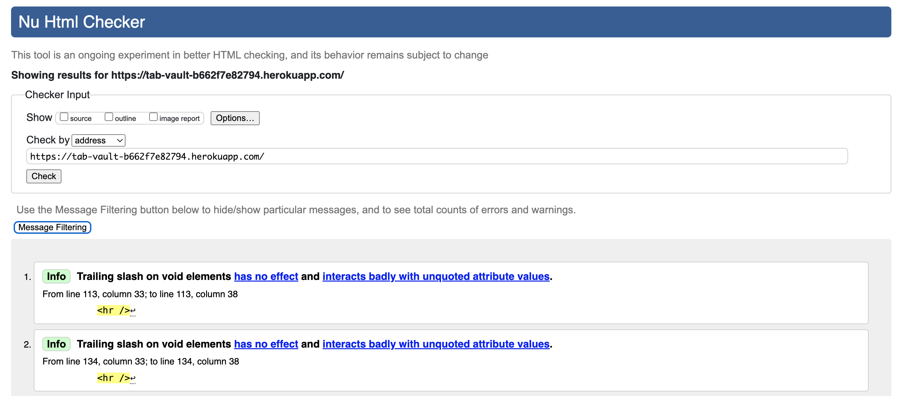

# TabVault

TabVault is an online platform designed to help creators organize, store, and manage their guitar tabs. The platform allows users to bookmark tabs for easy access and manage them through a secure dashboard. This project is part of the Code Institute's Full-Stack Developer course and focuses on the Django framework, database management, and CRUD functionality.

## TabVault Homepage

Live site: [TabVault](https://tab-vault-b662f7e82794.herokuapp.com/)

## Table of Contents
- [Overview](#overview)
- [UX - User Experience](#ux-user-experience)
  - [Colour Scheme](#colour-scheme)
  - [Font](#font)
- [Project Planning](#project-planning)
  - [Site Goals](#site-goals)
  - [User Stories](#user-stories)
  - [Wireframes](#wireframes)
  - [Entity Relationship Diagram](#entity-relationship-diagram)
- [Security](#security)
- [Features](#features)
- [Future Features](#future-features)
- [Technologies Used](#technologies-used)
- [Testing](#testing)
  - [Validation Testing](#validation-testing)
  - [Lighthouse Testing](#lighthouse-testing)
  - [User Testing](#user-testing)
  - [Bugs](#bugs)
- [Deployment](#deployment)
- [Credits](#credits)
  - [Code](#code)
  - [Media](#media)
  - [Additional reading/tutorials/books/blogs](#additional-readingtutorialsbooksblogs)
  - [Acknowledgements](#acknowledgements)

## Overview

TabVault is a platform that allows the tab creator to:
- Store their tabs.
- Provide easy access to consumers.
- Provide consumers with a streamlined experience

A significant share of content creators in the guitar sphere create their own tabs. Many of these creators resort to third party websites, or have their own in order to share them. This platform is designed to provide a creator with the means to share their guitar tablature. There is a future potential to also put tabs behind a paywall. 

## UX - User Experience

### Colour Scheme

<b>Linen (#FFF1E6):</b> Clean and warm backgrounds.

<b>Fairy Tale (#FEC8D8):</b> For primary buttons (download link).

<b>Melon (#F8B195):</b> For hover states.

<b>Platinum (#E6E6E6):</b> Borders & dividers.

<b>Space cadet (#2F2E41):</b> Text.

<b>Mint green (#B8E1DD):</b> Secondary buttons

### Font
<b>Merriweather (for titles):</b> Was chosen for titles as it is highly readable, with a traditional, formal feel. 

<b>Roboto (for body text):</b> Was chosen for the body text, as it is clean and legible. Also, it's popularity and widespread use provides the user with familiarity. 

The contrast in style between the 'classic' Merriweather and the more 'modern' Roboto helps draw attention to headings and provides a clear visual separation.

## Project Planning

### Site Goals
- Allow users to bookmark and manage tabs.
- Provide an intuitive and accessible dashboard.
- Ensure data security for registered users.
- Full responsivity.

### Project Management
This project was primarily managed through use of the GitHub project board, using issues, with MoSCoW prioritisation. There was additional use of a physical to-do list, for smaller issues.

### User Stories

Must haves:

- As a Creator, I can upload tabs so that I can share my work with users.
  - AC1: Given a logged-in creator, they can upload a tab file and metadata (title, artist, genre, difficulty).
  - AC2: Then the file is securely stored.

- As a Creator, I can edit or delete my uploaded tabs so that I can keep my content up to date.
  - AC1: Given a logged-in creator, they can edit metadata (e.g., title, genre, artist) of their uploaded tabs.
  - AC2: Given a logged-in creator, they can delete a tab they uploaded.

- As a user I can login to access all user privileges.
  - AC1: When not logged in, register and login buttons present
  - AC2: When logged in, sign out button present
  - AC3: After login/register, redirect to home page

- As a Site User, I can view detailed information about a tab so that I can decide whether to download it.
  - AC1: Given a tab title is clicked, the user is directed to a detailed view showing its metadata (title, artist, genre, difficulty).
  - AC2: When the tab is viewed, the view count increments.
  - AC3: Then users see reviews and ratings submitted by others.

- As a Site Admin, I can view and manage all content and users so that I can ensure the platform runs smoothly.
  - AC1: Admins can view all uploaded tabs, reviews, and user profiles.
  - AC2: Admins can deactivate or delete inappropriate tabs, reviews, or accounts.

- As a Site User, I can browse and discover tabs so that I can find content relevant to me.
  - AC1: When visiting the homepage, users see tabs.
  - AC2: Then users can search for tabs by genre, difficulty, or artist.
  - AC3: When filtering tabs, the results update dynamically.

Should haves:

- As a User, I can leave reviews and ratings for a tab so that I can provide feedback to the creator.
  - AC1: Given a logged-in user, they can submit a star rating (1–5).
  - AC2: Given a logged-in user, they can add a text comment.
  - AC3: Then the review is associated with the user and the tab.

- As a User, I can bookmark tabs so that I can save them for later.
  - AC1: Given a logged-in user, they can click a "bookmark" button to save a tab.
  - AC2: Then the user can view a list of their bookmarked tabs in their profile/dashboard.
  - AC3: When a bookmarked tab is deleted by the creator, it is automatically removed from the user's list.
  
- As a User, I can view and edit bookmarks.

- As a User, I can modify or delete my review so that I can correct or remove my feedback.
  - AC1: Given a logged-in user, they can edit the text and rating of their submitted review.
  - AC2: Given a logged-in user, they can delete their review.
  - AC3: Then the review updates are reflected immediately.

- As a user I can utilise a search bar so that I can find a tab.
  - AC1: Search bar can be found easily
  - AC2: Upon searching a title, artist or genre, a list of relevant tabs comes up
  - AC3: If there are no relevant results, the user is given a response

Could haves: 

- As a user I can see the average rating so that I know which tabs are the most highly rated.
  - AC1: Reviews average star rating is shown.
  - AC2: You can sort by average rating
  - AC3: Average ratings update as reviews are added or deleted

- As a Creator, I can create and manage my profile so that users can learn about me and my work.
  - AC1: Given a logged-in user, they can add or update their bio.
  - AC2: Given a logged-in user, they can upload or change a profile picture.
  - AC3: Then their profile displays their uploaded tabs.

- As a Creator, I can view analytics for my tabs so that I can track their performance.
  - AC1: When visiting the creator dashboard, creators see views and average ratings for each tab.
  - AC2: Then creators can view aggregated metrics (e.g., total uploads, total reviews).

These user stories were then categorised using MoSCoW prioritisation.

### Wireframes

Homepage:

  
   

Tab detail page:

  
   

Bookmarks page:

  
   

Search results page:

  
   

### Entity Relationship Diagram

Dot file generated using <a href ="https://pypi.org/project/pydot/">pydot</a>

Converted to PNG using <a href="https://onlineconvertfree.com/convert-format/dot-to-png/">onlineconvertfree</a>

## Security
Django's built-in security features handles all data securely:
- Passwords are encrypted.
- Forms are CSRF protected.
- Permission to access data is restricted by role.

## Features

### User View - Unregistered
- When a user is unregistered, they have access to all tabs, with the ability to search, fully navigate and download.
- However, the user is unable to leave a review, or access the bookmarking page and feature.

### Reviews
- When a user is logged in, they can submit a review for each tab, with a 1-5 star rating and additional text. 
- The star ratings are stored for each tab, and they are aggregated and averaged, then displayed to the user.

### Navigation bar
- When a user isn't logged in, the navigation bar displays options to login and register.
- When a user is logged in, only the logout option appears.
- The navbar is fully responsive, with a dropdown appearing on tablet-sized screens and smaller.
- The users login status is displayed.

### Search bar
- The navigation bar has a search bar present, which allows users to search for the tab title, artist, and genre.

### Bookmark Feature
- When logged in, and viewing a tab_detail page, the user can either add or remove the tab to their 'bookmarks'.
- The user can access their bookmarked tabs, using the bookmarked tabs button on the navigation bar.
- In the bookmarked_tabs page, the user's bookmarked tabs are displayed.

### View count
- When a user visits a particular tab_detail page, the view count increments by 1.

## Future Features

### Many creators
- Currently the site is for the use of only one creator, as many such websites are.
- In the future, many users, apon admin validation, will be able to have a 'creator' account, with the ability to create profiles and add tabs with full CRUD functionality.

### Monetization
- In order to view a tab, the user has to pay to gain access priveleges.
- Creators can set their own prices.

## Technologies Used
### Languages
- HTML5, CSS3 - Markup and styling languages.
- Javascript - For interactivity and dynamic content.
- Python - For backend functionality.
- PostgreSQL - Database management.

### Libraries & Frameworks
- Bootstrap - For frontend styling.
- Django - Backend framework.
- Cloudinary - For storing cloud-based files.
- Whitenoise - To serve static files.

### Tools & Programs
- GitHub - Version control.
- Heroku - Deployment.

## Testing

### Validation Testing

All HTML pages were validated using the <a href="https://validator.w3.org">W3C Markup Validation Service.</a>

index.html:

tab_detail.html:

bookmarked_tabs.html:

search_results.html:

The CSS was validated using the <a href="https://jigsaw.w3.org/css-validator/">W3C CSS Validation Service.</a>

style.css:

### Lighthouse testing

Mobile testing shows high levels of accessibility, strong use of best practise and good SEO. Performance is slightly under it's ideal level, however, this is due to render-blocking resources (shown below)

Desktop testing showed no issues.

Javascript was validated using <a href="https://jshint.com/">JSHint version 2.13.6:</a>

Python was tested for PEP8 compatibilty using the <a href="https://pep8ci.herokuapp.com/">CI Python Linter</a>, and the models.py, test_form, urls.py and views.py were edited for easier readability.

### User Testing

- The site was tested by multiple users.
- Responsivity was tested for, on varying everyday devices.
- Each user navigated the website, before and after creating an account.
- All features were found to be working as expected.

<strong>User Story Testing:</strong>

| Test                      | Result  |
| ------------------------- | ------- |
| Manage tabs               | Success |
| Upload tabs               | Success |
| Leave reviews and ratings | Success |
| Login                     | Success |
| View tab details          | Success |
| Edit reviews              | Success |
| Search bar functions      | Success |
| Manage content            | Success |
| Bookmark tabs             | Success |
| View analytics            | Success |
| Browse Tabs               | Success |

### Bugs

- Having to manually collectstatic for style.css changes to be visible on deployed site (static wasn't being loaded on index.html and sear_results.html pages)

- 

## Deployment

Throughout the development process, the site was deployed to Heroku from the main repository branch.

Three environment variables were set up in the Heroku application, replacing the locally saved variables within env.py (which is not subject to version control).
- DATABASE_URL: The string that connects to the database.
- SECRET_KEY: The app's secret key.
- CLOUDINARY_URL: The URL for Cloudinary's cloud based image hosting.

ElephantSQL provides the PostgreSQL database.

Once the app was setup, the TabVault GitHub repository was connected.

## Credits

### Code

### Media

Guitar player stock image - <a href="https://pixabay.com/photos/acoustic-guitar-guitarist-1851248/">Link</a>

Favicon - <a href="https://www.flaticon.com/free-icons/vault" title="vault icons">Vault icons created by Smashicons - Flaticon</a>

Converted to favicon using: https://favicon.io/favicon-converter/

### Additional reading/tutorials/books/blogs

### Acknowledgements

